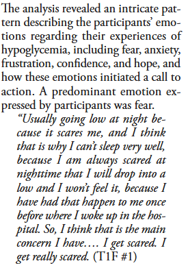
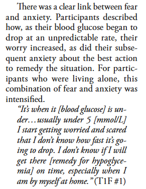
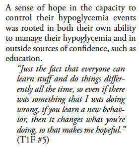

## Living With Hypoglycemia

### This example is extended from [Living With Hypoglycemia: An Exploration of Patients’ Emotions: Qualitative Findings From the InHypo-DM Study, Canada](https://pmc.ncbi.nlm.nih.gov/articles/PMC6695265/)2019 publication.

\

#### The purpose of this code is to examine how well LLMs can recover emotional states that were human coded in the publication without information about themes or context other than a user prompt. We use [Claude Sonnet 3.7](https://www.anthropic.com/news/claude-3-7-sonnet), an LLM optimized for computational efficiency and reliability in research applications, offering robust performance for systematic analysis, data processing, and academic workflows through multiple access including the use of an API.[^1] [Anthropic](https://privacy.anthropic.com/en/articles/10458704-how-does-anthropic-protect-the-personal-data-of-claude-ai-users), creator of Claude, takes user security and privacy seriously and conversations are not used for model training such as in other LLM platforms.

[^1]: Submitting an API request costs \$.05 and can use up to 1 million tokens. A token is a basic unit of text that AI language models process, typically representing words, parts of words, or punctuation marks.

\

Setting up Claude Sonnet 3.7 is simple via rstudio using the [elmer](https://github.com/tidyverse/ellmer) package but requires an API key and a credit card on file.

```{r, warning=FALSE, message=FALSE}
library(ellmer)
library(tidyverse)

# Note.
## initialize connection after adding api key to .Renvironment file
## usethis::edit_r_environ() opens file
```

In using LLMs it is important to provide it with a robust prompt that contains a single task and set of rules. Below we generate a simple prompt with basic rules. It is possible to provide the LLM a pdf document with a systematic coding schema.

```{r}

# test 2 with data
system_prompt <- paste(
  # task
  "You are a graduate researcher that will identify and categorize 
  emotional states expressed by participants during interviews about 
  their adversities living with type 1 and type 2 diabetes to better 
  understand hypoglycemia.",
  # rules
  "#keep the response brief",
  "* Use examples when helpful.",
  # format
  collapse = "\n"
)

```

### We are also interested in how a local (e.g., smaller and less robust model) LLM such as llama 3.2 which is installed locally via ollama, performs on this task. The advantage of using llama is that it is installed locally which translates as a secured way of processing data and it is free as it uses local computing resources. The disadvantage is that these models tend to be much smaller compared to Claude, ChatGPT, and Gemini. 

We compare both models using the same user prompt. First we print the text from the paper, followed by the Claude, and llama assessments before moving on to the next text example.

```{r}
client_claude <- chat_anthropic(system_prompt, 
                                model = "claude-3-7-sonnet-latest")

client_llama <- chat_ollama(system_prompt, 
                            model = "llama3.2:3b")
```

Finally, we pass it examples from interviews found in the public on page 272, results section.



```{r}
string_ex <- "Usually going low at night because it scares me, 
and I think that is why I can’t sleep very well, because I 
am always scared at nighttime that I will drop into a low 
and I won’t feel it, because I have had that happen to me 
once before where I woke up in the hospital. So, I think 
that is the main concern I have…. I get scared. I get 
really scared."

client_claude$chat(string_ex)
client_llama$chat(string_ex)
```



```{r}
string_ex <- "It’s when it [blood glucose] is under…usually 
under 5 [mmol/L] I start getting worried and scared that 
I don’t know how fast it’s going to drop. I don’t 
know if I will get there [remedy for hypoglycemia] on 
time, especially when I am by myself at home."

client_claude$chat(string_ex)
client_llama$chat(string_ex)
```



```{r}
string_ex <- "Just the fact that everyone can learn stuff 
and do things differently all the time, so even if there 
was something that I was doing wrong, if you learn a new 
behavior, then it changes what you’re doing, so that 
makes me hopeful."

client_claude$chat(string_ex)
client_llama$chat(string_ex)
```

\

### These examples clearly show the advantage of using LLMs for this research as they come very close to human coding with minimal instructions. We do not recommend a full replacement of human coders but rather to integrate LLMs into a coding schema workflow in order to compliment data analysis. Claude tended to perform slightly better than llama using these examples. However, these examples from the paper were probably chosen for their clear indications of the emotional states of interest to the researchers. We are uncertain how these LLMs would perform with ambiguous examples of emotional states at this point. 

\
